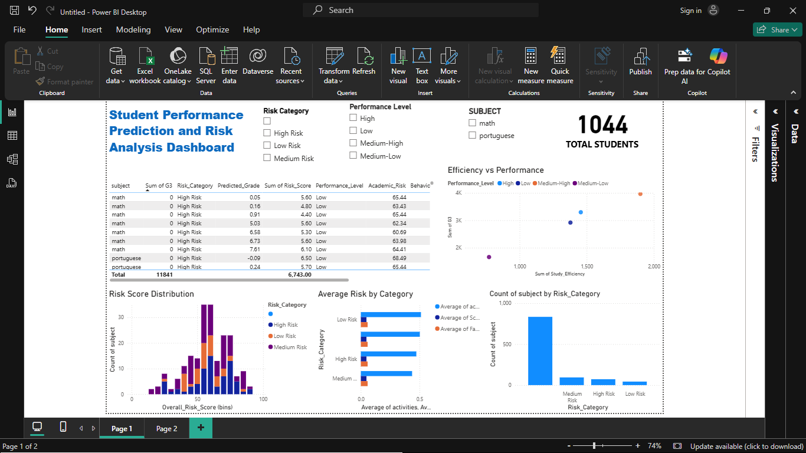
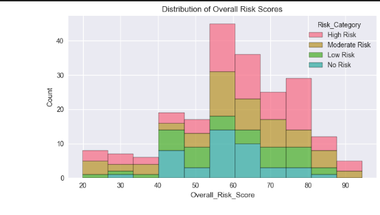
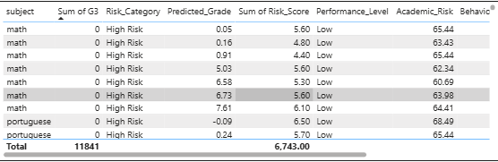
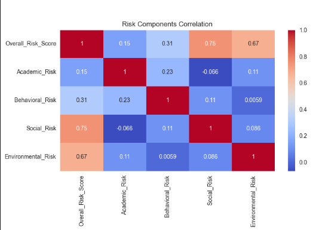
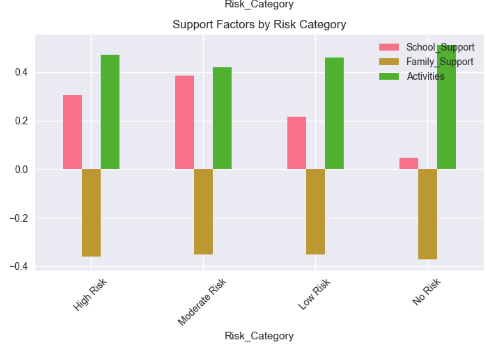

# 🎓 Student Academic Performance & Risk Analytics

## 📝 Project Overview

This project analyzes student academic performance using the UCI Student Performance Dataset. It combines data cleaning, feature engineering, machine learning, and advanced risk analytics to identify at-risk students and provide actionable recommendations. The results are visualized in an interactive Power BI dashboard.

---

## 📚 Table of Contents

- [📝 Project Overview](#project-overview)
- [📂 Data Sources](#data-sources)
- [📁 Project Structure](#project-structure)
- [🧹 Data Preparation](#data-preparation)
- [📊 Exploratory Data Analysis](#exploratory-data-analysis)
- [🤖 Modeling & Risk Analysis](#modeling--risk-analysis)
- [📈 Power BI Dashboard](#power-bi-dashboard)
- [💡 Key Insights & Recommendations](#key-insights--recommendations)
- [🖼️ Screenshots](#screenshots)
- [🚀 How to Run](#how-to-run)
- [👥 Authors & Acknowledgments](#authors--acknowledgments)

---

## 📂 Data Sources

- **student-mat.csv** and **student-por.csv** from the UCI Machine Learning Repository
- Cleaned and merged into `student-merged-cleaned.csv`
- Risk and intervention outputs: `detailed_risk_analysis.csv`, `intervention_recommendations.csv`, `powerbi_export.csv`

---

## 📁 Project Structure

```
Capstone-Project/
├── notebooks/
│   ├── analysis.ipynb
│   ├── student-mat.csv
│   ├── student-por.csv
│   ├── student-merged-cleaned.csv
│   ├── powerbi_export.csv
│   ├── detailed_risk_analysis.csv
│   └── intervention_recommendations.csv
├── powerbi/
│   └── student_dashboard.pbix
├── screenshots/
│   ├── dashboard_overview.png
│   ├── risk_distribution.png
│   ├── high_risk_table.png
│   ├── risk_components.png
│   └── support_factors.png
├── README.md
```

---

## 🧹 Data Preparation

- 🧽 **Missing values** and **duplicates** were removed.
- 🏷️ **Categorical variables** were encoded.
- 🛠️ **Feature engineering** included:
  - `total_study_time`
  - `parent_education`
  - `alcohol_consumption`
- 💾 Cleaned datasets saved for reproducibility.

---

## 📊 Exploratory Data Analysis

- 📈 **Descriptive statistics**: mean, median, mode, std, quartiles, outlier detection.
- 📉 **Visualizations**: grade distributions, correlation heatmaps, boxplots for key features.

---

## 🤖 Modeling & Risk Analysis

- 🏆 **Models Used**: Random Forest, XGBoost, Ensemble
- 🚦 **Risk Scoring**: Multi-factor (academic, behavioral, social, environmental)
- 🆘 **Interventions**: Generated for high-risk students
- 📤 **Outputs**: `detailed_risk_analysis.csv`, `intervention_recommendations.csv`

---

## 📈 Power BI Dashboard

- 📥 **Data Imported**: `powerbi_export.csv`, `detailed_risk_analysis.csv`, `intervention_recommendations.csv`
- 🖼️ **Key Visuals**:
  - 📊 Risk distribution (bar/pie chart)
  - 🧑‍🎓 High-risk student table
  - ⏳ Performance by study time
  - 🧩 Risk component analysis
  - 🏠 Support factors by risk category
  - 🎛️ Slicers for interactivity
  - 🧮 Cards for total students, high-risk count, averages, etc.
- 🚀 **Advanced Features**:
  - 🧠 Key Influencers visual
  - 🎨 Conditional formatting
  - 🔖 Bookmarks and tooltips

---

## 💡 Key Insights & Recommendations

- 📚 **Previous grades** and **study time** are strong predictors of performance.
- 🚨 **Absences** and **failures** are highly correlated with risk.
- 👨‍👩‍👧‍👦 **Parental education** and **support factors** impact student outcomes.
- 🏥 **Early intervention** and targeted support are recommended for high-risk students.

---

## 🖼️ Screenshots

### 🏠 Dashboard Overview


### 📊 Risk Distribution


### 🧑‍🎓 High-Risk Student Table


### 🧩 Risk Component Analysis


### 🏠 Support Factors by Risk Category


---

## 🚀 How to Run

1. **Clone the repository** and open in VS Code or Jupyter.
2. **Run `analysis.ipynb`** to reproduce data cleaning, EDA, modeling, and export.
3. **Open Power BI Desktop** and import `powerbi_export.csv` (and other outputs as needed).
4. **Build or open the dashboard** (`student_dashboard.pbix`).
5. **Explore the dashboard** using slicers, cards, and visuals.

---

## 👥 Authors & Acknowledgments

- **Author:** NIBISHAKA THOTI PACIFIQUE
- **Lecturer:** Eric Maniraguha, Faculty of Information Technology, AUCA
- **Data Source:** UCI Machine Learning Repository

---

## 📝 License

This project is for academic purposes. Please cite appropriately if you use or adapt this work.

---